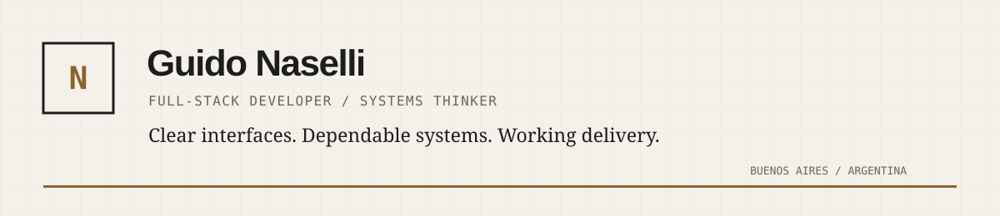

I build dependable digital products by connecting product thinking, clear interfaces and maintainable systems.

My work spans enterprise applications, product interfaces and independent web projects. I care about why something exists before deciding how to build it.

## Current focus

Currently building enterprise monitoring software with **Angular**, **Java** and **Spring Boot**, while completing a Bachelor's degree in Computer Science.

## Selected work

A selection of websites, products and systems I have designed, developed and delivered.

[View portfolio](https://guidonaselli-portfolio.vercel.app/) →

## Working with

`Java` · `Spring Boot` · `Angular` · `TypeScript` 
`Next.js` · `Astro` · `PostgreSQL` · `Docker` 
`Product thinking` · `Interface systems` · `Delivery`

## Elsewhere

[LinkedIn](https://www.linkedin.com/in/guido-naselli-aa02a0171/) · [Portfolio](https://guidonaselli-portfolio.vercel.app/) · [Naselli Studio](https://nasellistudio.com)
